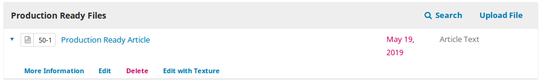

Texture plugin for OJS3
=======================
### About
This plugin integrates the Texture editor with OJS workflow for direct editing of JATS XML documents.
### Installation
Texture is available under Plugin gallery
 
* Settings -> Web site -> Plugins -> Plugin gallery 

### Usage
Texture supports editing XML files in [JATS](https://jats.nlm.nih.gov/archiving/1.1/) XML standard.
* After plugin installation,  go to a `Production Stage` of the submission
* Upload JATS XML to the  `Production Ready` state. You can find sample files [blank manuscript](https://github.com/substance/texture/tree/master/data/blank) or a [list of samples](https://github.com/substance/texture/tree/master/data/) here.

* All the uploaded images in texture are integrated as dependent files in production ready stage.
* When you later publish the texture-edited JATS XML file as galley, you have to upload the images **again** in the dependancy grid.

* In the editing modal, upload the same images as dependent files you uploaded for texture.  

Tag| Description| Link| | 
| --- | --- | --- | --- 
[<address>](https://jats.nlm.nih.gov/archiving/tag-library/1.3d1/element/address.html)| [Address/Contact Information](https://jats.nlm.nih.gov/archiving/tag-library/1.3d1/element/address.html)
[<array>](https://jats.nlm.nih.gov/archiving/tag-library/1.3d1/element/array.html)| [Array (Simple Tabulation)](https://jats.nlm.nih.gov/archiving/tag-library/1.3d1/element/array.html)
[<boxed-text>](https://jats.nlm.nih.gov/archiving/tag-library/1.3d1/element/boxed-text.html)| [Boxed Text](https://jats.nlm.nih.gov/archiving/tag-library/1.3d1/element/boxed-text.html)
[<chem-struct-wrap>](https://jats.nlm.nih.gov/archiving/tag-library/1.3d1/element/chem-struct-wrap.html)| [Chemical Structure Wrapper](https://jats.nlm.nih.gov/archiving/tag-library/1.3d1/element/chem-struct-wrap.html)
[<code>](https://jats.nlm.nih.gov/archiving/tag-library/1.3d1/element/code.html)| [Code](https://jats.nlm.nih.gov/archiving/tag-library/1.3d1/element/code.html)
[<fig>](https://jats.nlm.nih.gov/archiving/tag-library/1.3d1/element/fig.html)| [Figure](https://jats.nlm.nih.gov/archiving/tag-library/1.3d1/element/fig.html)
[<fig-group>](https://jats.nlm.nih.gov/archiving/tag-library/1.3d1/element/fig-group.html)| [Figure Group](https://jats.nlm.nih.gov/archiving/tag-library/1.3d1/element/fig-group.html)
[<graphic>](https://jats.nlm.nih.gov/archiving/tag-library/1.3d1/element/graphic.html)| [Graphic](https://jats.nlm.nih.gov/archiving/tag-library/1.3d1/element/graphic.html)
[<media>](https://jats.nlm.nih.gov/archiving/tag-library/1.3d1/element/media.html)| [Media Object](https://jats.nlm.nih.gov/archiving/tag-library/1.3d1/element/media.html)
[<preformat>](https://jats.nlm.nih.gov/archiving/tag-library/1.3d1/element/preformat.html)| [Preformatted Text](https://jats.nlm.nih.gov/archiving/tag-library/1.3d1/element/preformat.html)
[<supplementary-material>](https://jats.nlm.nih.gov/archiving/tag-library/1.3d1/element/supplementary-material.html)| [Supplementary Material Metadata](https://jats.nlm.nih.gov/archiving/tag-library/1.3d1/element/supplementary-material.html)
[<table-wrap>](https://jats.nlm.nih.gov/archiving/tag-library/1.3d1/element/table-wrap.html)| [Table Wrapper](https://jats.nlm.nih.gov/archiving/tag-library/1.3d1/element/table-wrap.html)
[<table-wrap-group>](https://jats.nlm.nih.gov/archiving/tag-library/1.3d1/element/table-wrap-group.html)| [Table Wrapper Group](https://jats.nlm.nih.gov/archiving/tag-library/1.3d1/element/table-wrap-group.html)
### Issues
Please find any issues here 
* https://github.com/pkp/texture/issues
